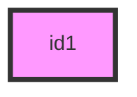
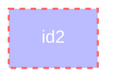

🏴‍☠ , ☠️ , 🎯 , 📤 , 📥 , ⭐ , ❌ , ✅ , 🌍 , 🔑 , ➕ , ✏️ , 🖍️ , 😍 , 🚧 , ⏎ , 🔧 , 🛠️, 

> 🔴🚨 Warning

> 🟡💡 Tips / Solutions

> 🔵ℹ️ Information

[Markdown Table Generator](https://www.tablesgenerator.com/markdown_tables)

[Mermaid Live Editor ](https://mermaid-js.github.io/mermaid-live-editor)

[Color RGB(a) / Hex Tool](https://www.hexcolortool.com/)

`style id1 fill:#f9f,stroke:#333,stroke-width:4px`

`style id2 fill:#bbf,stroke:#f66,stroke-width:2px,color:#fff,stroke-dasharray: 5 5`

[Font Awesome Icons](https://fontawesome.com/v4.7.0/icons/)